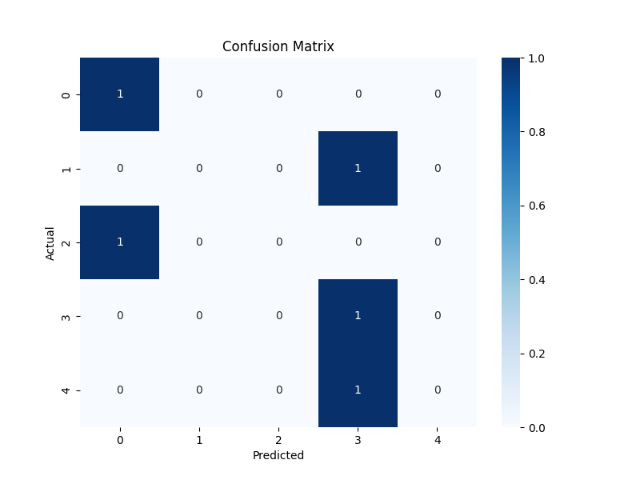

# AI Resume Screening

## 📌 Project Overview
This AI Resume Screening project automates the process of analyzing resumes using **Natural Language Processing (NLP)** and **Machine Learning**. It extracts text from resumes, applies **TF-IDF vectorization**, and classifies resumes into different job roles using a **Logistic Regression model**.

## 🚀 Features
- **Extract text** from `.docx` resumes
- **TF-IDF Vectorization** for text processing
- **Logistic Regression model** for classification
- **Performance Metrics** (Accuracy, Precision, Recall, F1-score, Confusion Matrix)
- **Model Persistence** using `.pkl` files
- **Visualizations** for evaluation

## 🏗️ Tech Stack
- **Python** (Core Language)
- **pandas** (Data Handling)
- **docx** (Text Extraction)
- **scikit-learn** (Machine Learning)
- **joblib** (Model Saving/Loading)
- **matplotlib & seaborn** (Visualization)

## 📂 Project Structure
```
AI_Resume_Screening/
│── data/
│   ├── dataset.csv  # Resume dataset with labels
│── backend/
│   ├── model/
│   │   ├── resume_model.pkl  # Saved ML Model
│   │   ├── tfidf_vectorizer.pkl  # Saved Vectorizer
│   │   ├── classification_report.txt  # Model Evaluation
│   │   ├── confusion_matrix.png  # Confusion Matrix Plot
│── scripts/
│   ├── train_model.py  # Training & Evaluation Script
│   ├── predict.py  # Script for Making Predictions
│── README.md  # Documentation
```

## ⚙️ Installation & Setup
1️⃣ **Clone the repository**
```bash
git clone https://github.com/your-username/AI_Resume_Screening.git
cd AI_Resume_Screening
```

2️⃣ **Create a virtual environment & install dependencies**
```bash
python -m venv venv
source venv/bin/activate  # On Windows use `venv\Scripts\activate`
pip install -r requirements.txt
```

3️⃣ **Run the training script**
```bash
python scripts/train_model.py
```

4️⃣ **Run the prediction script**
```bash
python scripts/predict.py "resume.docx"
```

## 📊 Model Evaluation
- **Accuracy**: 40%
- **Precision, Recall, F1-score**: *(See classification_report.txt)*
- **Confusion Matrix**:
  

## 🛠️ Usage
### **Train the Model**
```python
python scripts/train_model.py
```
### **Make Predictions**
```python
python scripts/predict.py "path/to/resume.docx"
```

## 📜 License
This project is licensed under the **MIT License**.

## 🤝 Contributions
Feel free to **fork** this repository and create a **pull request** if you want to contribute!

---
